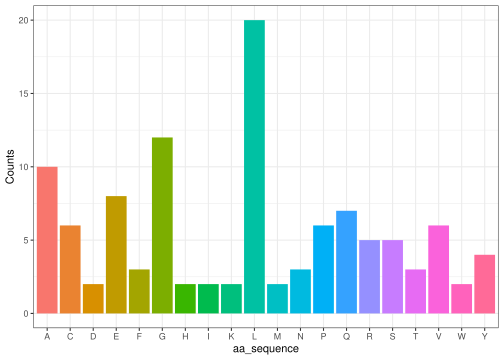

<!-- README.md is generated from README.Rmd. Please edit that file -->

# hejpakken

## Description of hejpakken package

This package called hejpakken is used for creating functions that can
help automation of converting a DNA sequence into a sequence of amino
acids. This represents the different steps in protein synthesis which is
a part of the central dogma.

## The five functions of hejpakken

``` r
library("hejpakken")
```

### 1. Nucleotide sequence sampler

The nucleotide sequence sampler samples a selected number of DNA bases
into a DNA sequence. As an example, here is a sequence of 24 bases:

``` r
nucleotide_sequence_sampler(24)
#> [1] "AAGCGAGAATACTTCCACGGTTAC"
```

### 2. Convert T to U

The converter of T to U changes DNA sequences into RNA sequences. This
is done by converting “T” to “U” in strings. An example is written here:

``` r
DNA_sequence <- "ACGTTGCA" 
convert_T_to_U(DNA_sequence)
#> [1] "ACGUUGCA"
```

### 3. Extract codons

The code extract function splits one string representing a RNA sequence
into several different codons. For each three letters (nucleotides) in
the input string, a new string containing three letters (codons) will be
formed. An example is presented here:

``` r
RNA_sequence <- "ACGUUGCA"
extract_codons(RNA_sequence)
#> [1] "ACG" "UUG"
```

### 4. Codon to Amino Acids

This function takes a list of strings containing three letters
representing nucleotides and return one string containing letters
representing amino acids. Here an example is presented:

``` r
codons <- c("ACG","UUG")
codon_to_AA(codons)
#> [1] "TL"
```

### 5. Amino acid frequency plot

The amino acid count of insulin is illustrated with the function below:

``` r
INS <- "MALWMRLLPLLALLALWGPDPAAAFVNQHLCGSHLVEALYLVCGERGFFYTPKTRREAEDLQVGQVELGGGPGAGSLQPLALEGSLQKRGIVEQCCTSICSLYQLENYCN"

amino_acid_plot(INS)
```



### Merging all the functions

The functions can be used all together, where you can illustrate the
frequency of different amino acids, based on random base sampling. This
can illustrate that if the base is sampled randomly, then some amino
acids are of higher likability than others. In the end, the amino acid
plot is saved under the variable `p1` .

``` r
#150 random bases are sampled
dna_bases <- nucleotide_sequence_sampler(150)
#Bases are converted to RNA string
rna_bases <- convert_T_to_U(dna_bases)
#The rna bases are converted into codons
codons <- extract_codons(rna_bases)
#The codons are translated into an amino acid sequence
aa_sequence <- codon_to_AA(codons)
#The amino acids are illustrated in a count barplot
p1 <- amino_acid_plot(aa_sequence)
```

## Further development of hejpakken

Other functions that could be included could be to categorize the amino
acids based on chemical properties like their hydrophobic hydrophilic
characteristics , acidic/basic conditions, polarity and
aliphatic/aromatic properties.

In function five, the two packages were added as dependencies by using
`@importFrom package function` tag to load the ggplot2 and stringr
packages.

It’s a good idea to limit the number of dependencies of the package,
since they can increase the risk of compatibility issues, slow down
package installation. It can increase the potential for errors if one of
the dependencies updates or changes functionality.

The differences between adding an `@importFrom package function` tag to
a function description compared to using `package::function()` is that
`@importFrom package function` adds the function to your package’s
namespace as a formal dependency, loading the external package whenever
your package is loaded. In contrast, `package::function()` does not add
it to the namespace, loading the package only when needed, which keeps
your package lighter.
